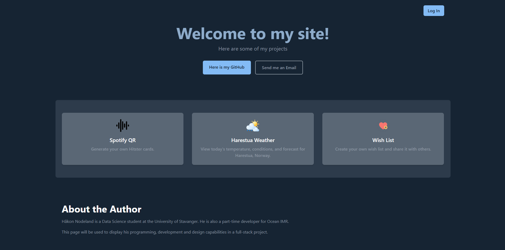
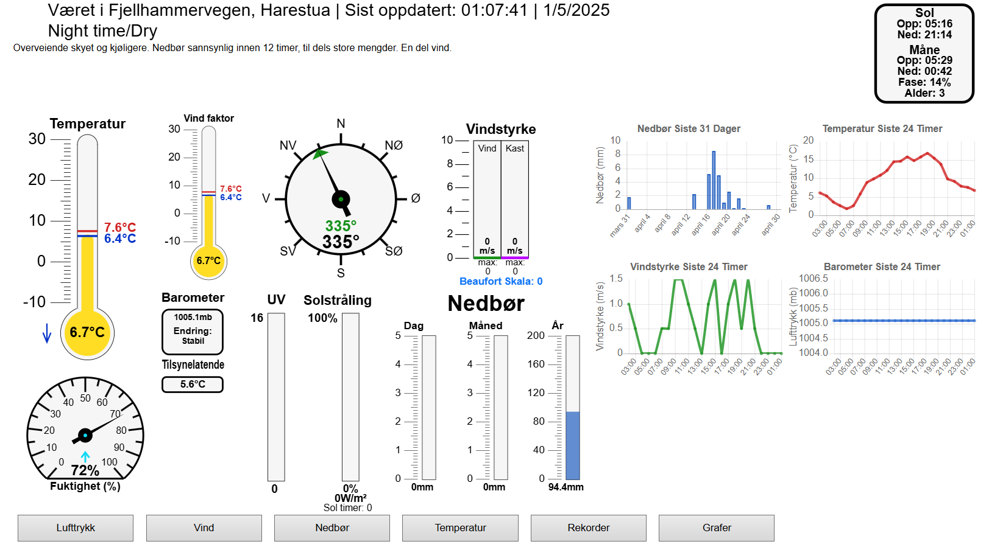

# Nodeland.no

This is a project i've been working on for a little while.

The goal of this project is to familiarize with some new technologies like react and node js. Three apps are going to be created and (hopefully hosted) here.

### Spotify QR
I want to genereate 2-sided cards with a spotify url/qr code on one side and the songs artis, release year and song name on the other side. The user will provide a public spotify play list, and then receive a PDF that can be printed, double sided, allowing cards to be cut out and used.

### Harestua Weather
As of right now, nodeland.no is used to display weather data gathered by a weather station. It is pretty outdated, and it is in dire need of an upgrade. This is a good time to try to learn some cool front-end tricks. This is how nodeland.no is looking right now:

### Wish list
The 3rd project is something my girlfriend and I discussed. We wanted an app where we could create a wish list, typically for weddings or large events, and then share it with others. The ones we shared the wish list with could then log in and check off something from the list. When others are checking out the wish list, they will be able to see who is going to get what. When the creators are checking out the wish-list however, they will not be able to see this. 

The purpose of this is app is to avoid people buying the same gifts for these larger events. 

### Future plans
Some time in the future, i am planning to use this site as a CV. I will upload all of my projects from school, as well as reports and other work. 

---

# Setup & Configuration

## Development Mode

We provide a `docker-compose.dev.yml` to run the entire stack with hot-reload:

### Start the site

    # First time or after changing Dockerfiles / dependencies:
    docker compose -f docker-compose.dev.yml up --build -d

This will:

- Launch a MySQL container (`nodeland-db`) with the initial schema  
- Launch the backend (`nodeland-backend`) using `npm run dev` (nodemon)  
- Launch the frontend (`nodeland-frontend`) using Vite’s dev server with HMR  

### Stop the site

    docker compose -f docker-compose.dev.yml down

### Rebuild a single service

If you add or remove NPM packages, rebuild only that service:

    # Rebuild & restart the backend
    docker compose -f docker-compose.dev.yml up -d --build backend

    # Rebuild & restart the frontend
    docker compose -f docker-compose.dev.yml up -d --build frontend

### Viewing Logs & Restarting Services

    # Tail backend logs
    docker compose -f docker-compose.dev.yml logs -f backend

    # Restart only the frontend
    docker compose -f docker-compose.dev.yml restart frontend

Once running in development mode, simply edit your code locally:

- **Backend**: nodemon will auto-reload on file changes  
- **Frontend**: Vite HMR will update your browser instantly  

No need to tear down and rebuild the entire stack on every code change!  

---

1. **Prerequisites**  
   - Node.js v16+ & npm v8+  
   - MySQL v5.7+  
   - A modern browser (Chrome, Firefox, Safari)

2. **Clone the Repo**  
       git clone https://github.com/HNodeland/nodeland.git  
       cd nodeland

3. **Backend (Express + MySQL + Google OAuth)**  
   - Copy and configure your env file:  
         cp server/.env.example server/.env  
     Edit `server/.env` and set:  
         DB_HOST=localhost  
         DB_USER=<your-mysql-username>  
         DB_PASS=<your-mysql-password>  
         DB_NAME=nodeland  
         PORT=4000  
         
         SESSION_SECRET=<random-secret>  
         GOOGLE_CLIENT_ID=<google-client-id>  
         GOOGLE_CLIENT_SECRET=<google-client-secret>  
         GOOGLE_CALLBACK_URL=http://localhost:4000/auth/google/callback  

   - Install dependencies and (optionally) create the database:  
         cd server  
         npm install  
         # mysql -u root -p -e "CREATE DATABASE IF NOT EXISTS nodeland;"  

   - Start the backend server:  
         npm start  

   The API will run at `http://localhost:4000`.

4. **Frontend (Vite + React + Tailwind)**  
   - Install and run:  
         cd ../client  
         npm install  
         npm run dev  

   Open `http://localhost:5173` in your browser. All `/api/*` and `/auth/*` calls are proxied to `localhost:4000`.

5. **Google OAuth Setup**  
   1. In Google Cloud Console → APIs & Services → Credentials, create an **OAuth 2.0 Client ID**.  
   2. Set the Authorized redirect URI to:  
         http://localhost:4000/auth/google/callback  
   3. Copy the Client ID and Secret into your `server/.env`.

6. **Production Build & Serve**  
       cd client  
       npm run build  
       cd ../server  
       # ensure NODE_ENV=production in server/.env  
       npm start  

   The server will serve the built frontend at `http://localhost:4000`.

7. **Troubleshooting**  
   - **MySQL errors**: verify `server/.env` credentials & that MySQL is running.  
   - **OAuth errors**: ensure the redirect URI in Google Console exactly matches `GOOGLE_CALLBACK_URL`.  
   - **Port conflicts**: adjust `PORT` in `server/.env` or the proxy in `client/package.json`.
